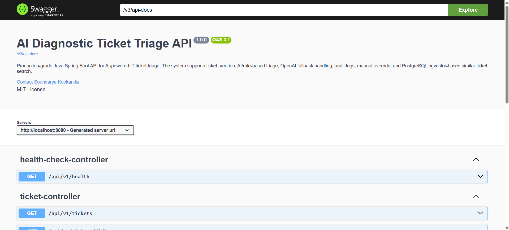
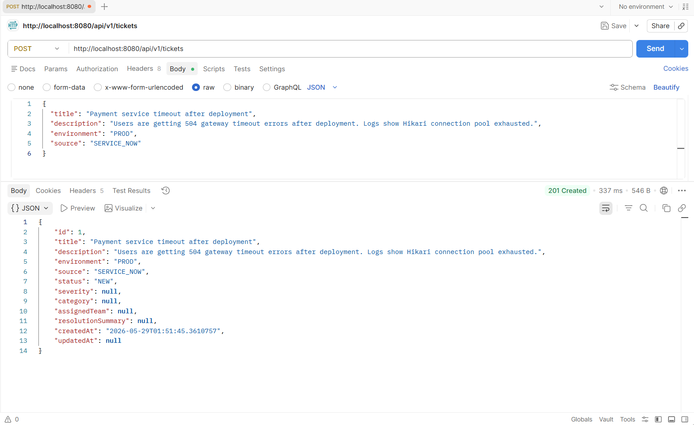
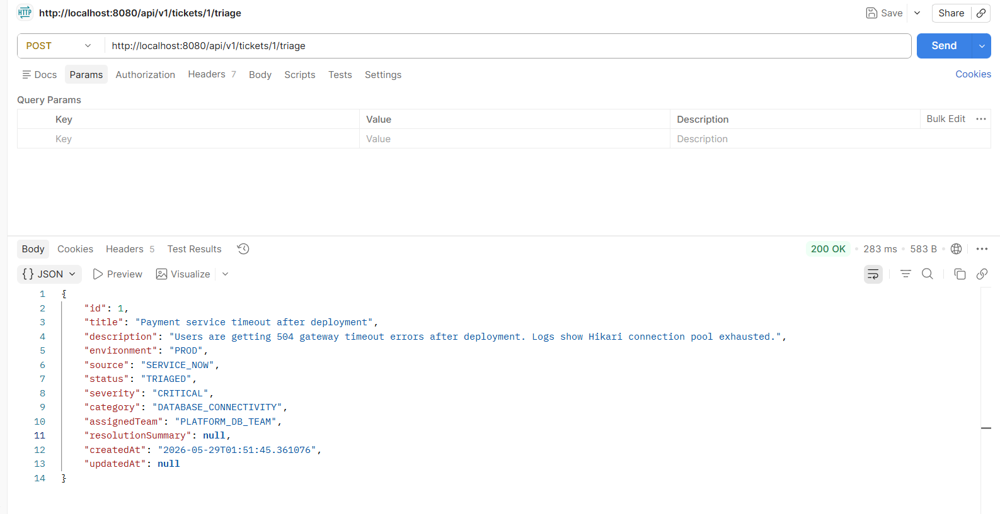
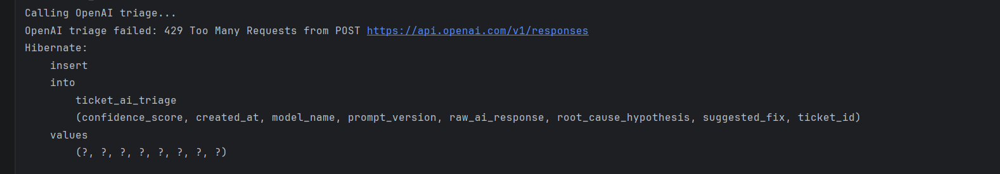
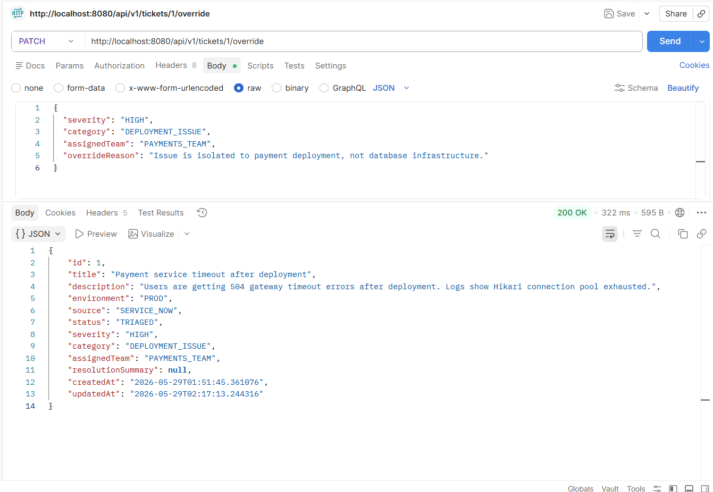
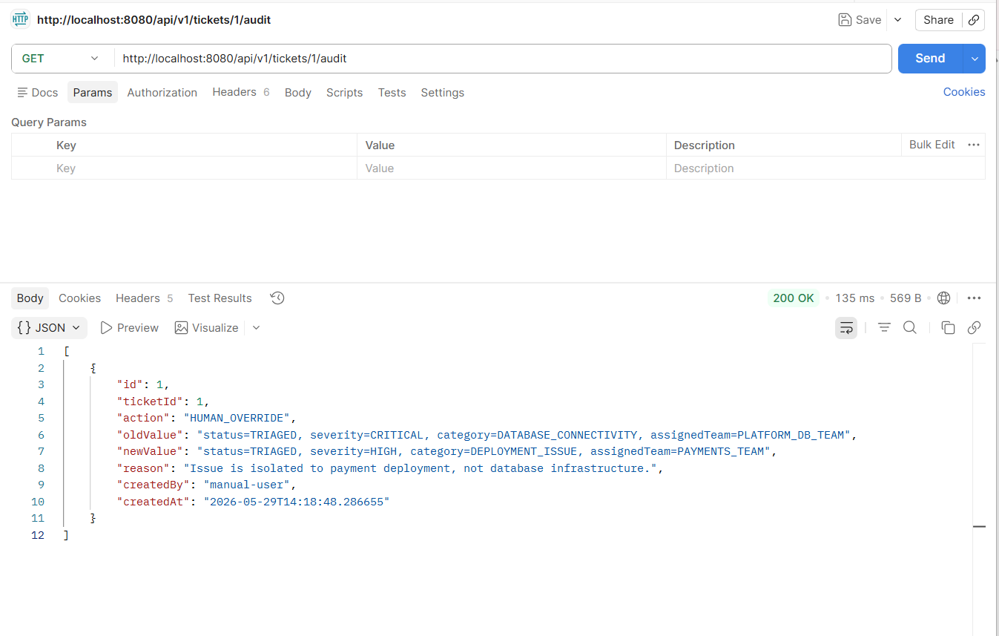
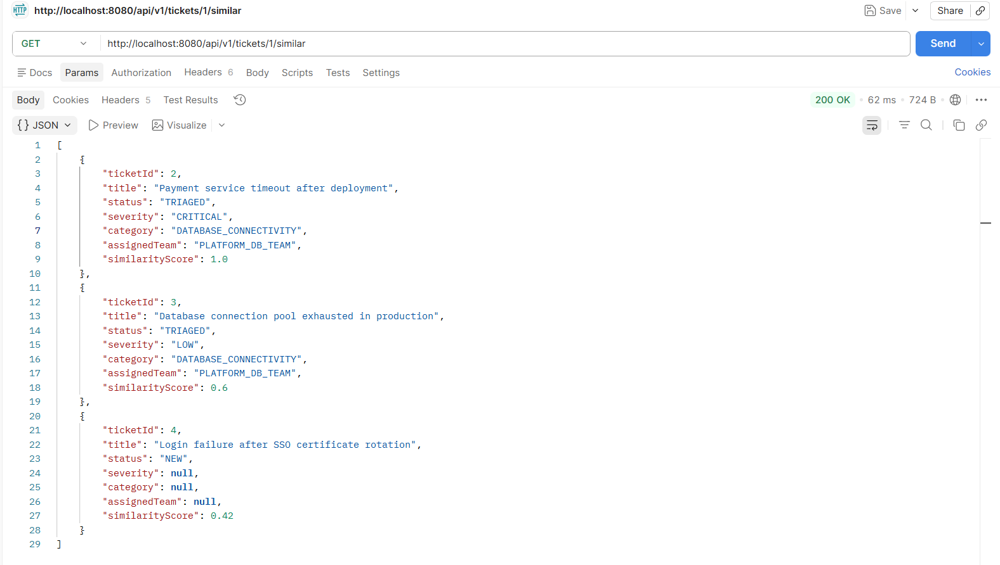
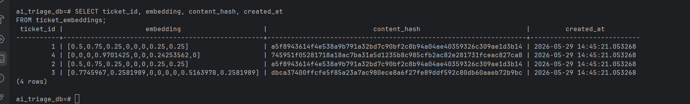
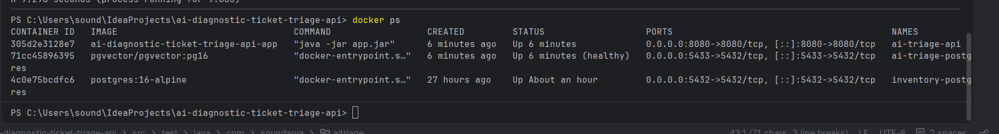
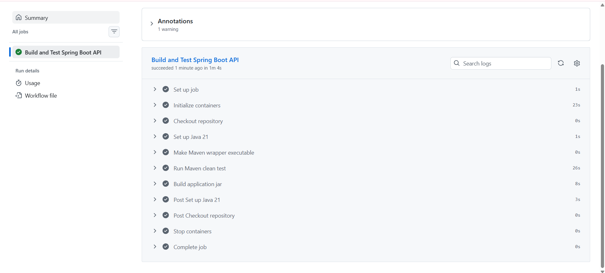

**AI Diagnostic Ticket Triage API** 
It is a production-style Java Spring Boot backend that uses AI to classify IT support tickets, predict severity, route incidents to the right team, retrieve similar historical tickets using PostgreSQL `pgvector`, and store every AI or human decision in an audit trail.

This project demonstrates practical backend engineering across:

- Java 21 and Spring Boot REST APIs
- PostgreSQL, JPA, Flyway, and pgvector
- OpenAI integration with fallback handling
- Human-in-the-loop AI design
- Audit logging and manual override workflows
- Docker Compose deployment
- Swagger/OpenAPI documentation
- JUnit, Mockito, and GitHub Actions CI

---

## Why I Built This Project

Enterprise support teams receive large volumes of incidents from tools like ServiceNow, Jira, or internal helpdesk systems. Manual triage can slow down incident resolution because engineers need to determine:

- What type of issue is this?
- How severe is it?
- Which team should own it?
- Has something similar happened before?
- Was the AI decision correct or overridden by a human?

I built this project to model a realistic backend system that uses AI safely inside an enterprise workflow. Instead of only calling an AI API, the system includes fallback logic, database persistence, audit logs, manual override, vector search, testing, and CI/CD validation.

---

## Problem Statement

Manual incident triage is time-consuming and inconsistent. A production support ticket may contain unstructured text such as:

```text
Payment service timeout after deployment.
Users are getting 504 gateway timeout errors.
Logs show Hikari connection pool exhausted.
```

The system should automatically identify:

```text
Severity: CRITICAL
Category: DATABASE_CONNECTIVITY
Assigned Team: PLATFORM_DB_TEAM
Probable Root Cause: Connection pool exhaustion
Suggested Fix: Check Hikari pool size, DB CPU, slow queries, and deployment configuration
```

The system must also support human review because AI decisions should be explainable, traceable, and correctable.

---

## What the System Does

When a ticket is created, the backend can:

1. Save the ticket in PostgreSQL.
2. Run AI triage using an OpenAI-backed client.
3. Fall back to a deterministic rule-based engine if OpenAI is unavailable or rate-limited.
4. Update the ticket with severity, category, and assigned team.
5. Store AI decision metadata in a separate table.
6. Allow manual override of AI decisions.
7. Store all AI and human actions in audit logs.
8. Generate embeddings for tickets.
9. Retrieve similar tickets using PostgreSQL `pgvector`.
10. Expose all APIs through Swagger.
11. Run locally or through Docker Compose.
12. Validate the build using automated GitHub Actions CI.

---

## Architecture

```text
Client / Postman / Swagger
        |
        v
Spring Boot REST API
        |
        |-- HealthCheckController
        |-- TicketController
        |
        |-- TicketService
        |     |-- Create ticket
        |     |-- Get ticket
        |     |-- Run triage
        |     |-- Manual override
        |     |-- Similar ticket search
        |
        |-- AiTriageService
        |     |-- OpenAiTriageClient
        |     |-- Rule-based fallback engine
        |
        |-- AuditLogService
        |     |-- AI triage audit
        |     |-- Human override audit
        |
        |-- TicketEmbeddingService
        |     |-- Local embedding generation
        |     |-- pgvector similarity query
        |
        v
PostgreSQL + pgvector
        |
        |-- tickets
        |-- ticket_ai_triage
        |-- ticket_audit_logs
        |-- ticket_embeddings
        |-- flyway_schema_history
```

---

## Tech Stack

| Layer | Technology Used |
|---|---|
| Language | Java 21 |
| Backend Framework | Spring Boot |
| REST APIs | Spring Web |
| Database Access | Spring Data JPA, JdbcTemplate |
| Database | PostgreSQL |
| Vector Search | pgvector |
| Schema Migration | Flyway |
| AI Integration | OpenAI API client with fallback |
| API Documentation | Swagger / OpenAPI |
| Testing | JUnit 5, Mockito |
| Containerization | Docker, Docker Compose |
| CI/CD | GitHub Actions |
| Build Tool | Maven |

---

## Implementation Walkthrough

### Stage 1: Spring Boot Foundation

I started by creating a Spring Boot project in IntelliJ using Java 21 and Maven.

Implemented a basic health endpoint:

```http
GET /api/v1/health
```

Example response:

```json
{
  "status": "UP",
  "service": "AI Diagnostic Ticket Triage API"
}
```

This verified that the Spring Boot application, REST controller, and local server setup were working.

---

### Stage 2: PostgreSQL and Flyway Setup

I added PostgreSQL using Docker Compose and configured Spring Boot to connect to the database.

I used Flyway instead of Hibernate auto-DDL so schema changes are version-controlled and repeatable.

Flyway migration V1 created the `tickets` table:

```sql
CREATE TABLE tickets (
    id BIGSERIAL PRIMARY KEY,
    title VARCHAR(255) NOT NULL,
    description TEXT NOT NULL,
    environment VARCHAR(30) NOT NULL,
    source VARCHAR(50),
    status VARCHAR(50) NOT NULL DEFAULT 'NEW',
    severity VARCHAR(50),
    category VARCHAR(100),
    assigned_team VARCHAR(100),
    resolution_summary TEXT,
    created_at TIMESTAMP NOT NULL DEFAULT CURRENT_TIMESTAMP,
    updated_at TIMESTAMP
);
```

Why this matters:

- Database schema is version-controlled.
- Migrations run automatically on application startup.
- The project behaves closer to production systems.

---

### Stage 3: Ticket CRUD APIs

I implemented the core ticket workflow using layered architecture:

```text
TicketController
        |
        v
TicketService
        |
        v
TicketRepository
        |
        v
PostgreSQL
```

Implemented APIs:

```http
POST /api/v1/tickets
GET  /api/v1/tickets
GET  /api/v1/tickets/{id}
```

Example ticket creation request:

```json
{
  "title": "Payment service timeout after deployment",
  "description": "Users are getting 504 gateway timeout errors after deployment. Logs show Hikari connection pool exhausted.",
  "environment": "PROD",
  "source": "SERVICE_NOW"
}
```

Example response:

```json
{
  "id": 1,
  "title": "Payment service timeout after deployment",
  "environment": "PROD",
  "source": "SERVICE_NOW",
  "status": "NEW"
}
```

---

### Stage 4: Validation and Global Exception Handling

I added request validation using Jakarta Bean Validation:

```java
@NotBlank(message = "Title is required")
@Size(max = 255, message = "Title must not exceed 255 characters")
```

I also added centralized error handling using:

```java
@RestControllerAdvice
```

This allows the API to return clean JSON errors instead of raw Java exceptions.

Example 404 response:

```json
{
  "status": 404,
  "error": "Not Found",
  "message": "Ticket not found with id: 999",
  "path": "/api/v1/tickets/999"
}
```

Why this matters:

- APIs are easier for frontend or external clients to consume.
- Error responses are consistent.
- Validation prevents bad data from reaching the database.

---

### Stage 5: AI Triage Workflow

I added an AI triage workflow:

```http
POST /api/v1/tickets/{id}/triage
```

The triage workflow updates the ticket with:

- Status
- Severity
- Category
- Assigned team
- Root cause hypothesis
- Suggested fix
- Confidence score

Example response:

```json
{
  "id": 1,
  "status": "TRIAGED",
  "severity": "CRITICAL",
  "category": "DATABASE_CONNECTIVITY",
  "assignedTeam": "PLATFORM_DB_TEAM"
}
```

The AI decision is stored in the `ticket_ai_triage` table.

Flyway migration V2 created:

```text
ticket_ai_triage
```

This table stores model name, prompt version, confidence score, root cause, suggested fix, and raw AI response.

---

### Stage 6: OpenAI Integration with Fallback

I added an `OpenAiTriageClient` that calls the OpenAI API from the backend.

The workflow is:

```text
AiTriageService
        |
        |-- Try OpenAI triage
        |
        |-- If OpenAI fails
              |
              v
           Rule-based fallback triage
```

This is important because external AI providers can fail due to:

- Missing API key
- Rate limit
- Network failure
- Invalid response
- Quota issue

When OpenAI returned `429 Too Many Requests`, the system still completed the triage using fallback logic and saved the fallback decision.

This is production-oriented because the API does not fail just because the AI provider is temporarily unavailable.

---

### Stage 7: Manual Override and Audit Logs

I added human-in-the-loop functionality.

Implemented:

```http
PATCH /api/v1/tickets/{id}/override
GET   /api/v1/tickets/{id}/audit
```

Manual override request:

```json
{
  "severity": "HIGH",
  "category": "DEPLOYMENT_ISSUE",
  "assignedTeam": "PAYMENTS_TEAM",
  "overrideReason": "Issue is isolated to payment deployment, not database infrastructure."
}
```

The system stores:

- Old value
- New value
- Action type
- Reason
- Created by
- Timestamp

Flyway migration V3 created:

```text
ticket_audit_logs
```

Why this matters:

- AI decisions are traceable.
- Human corrections are recorded.
- The system supports enterprise compliance and review workflows.

---

### Stage 8: Similar Ticket Search using PostgreSQL pgvector

I added semantic-style similar ticket search using PostgreSQL `pgvector`.

Implemented:

```http
POST /api/v1/tickets/embeddings/backfill
GET  /api/v1/tickets/{id}/similar
```

Flyway migration V4:

```sql
CREATE EXTENSION IF NOT EXISTS vector;

CREATE TABLE ticket_embeddings (
    id BIGSERIAL PRIMARY KEY,
    ticket_id BIGINT NOT NULL UNIQUE REFERENCES tickets(id),
    embedding vector(8) NOT NULL,
    content_hash VARCHAR(128) NOT NULL,
    created_at TIMESTAMP NOT NULL DEFAULT CURRENT_TIMESTAMP
);
```

For each ticket, the system generates a simple local embedding vector from keywords such as:

```text
database, hikari, timeout, deployment, authentication, network, performance, payment
```

Then similar tickets are retrieved using vector distance:

```sql
ORDER BY te.embedding <-> CAST(? AS vector)
```

Example response:

```json
[
  {
    "ticketId": 2,
    "title": "Database connection pool exhausted in production",
    "status": "TRIAGED",
    "severity": "CRITICAL",
    "category": "DATABASE_CONNECTIVITY",
    "assignedTeam": "PLATFORM_DB_TEAM",
    "similarityScore": 1.0
  }
]
```

Why this matters:

- Shows PostgreSQL beyond basic CRUD.
- Demonstrates vector search and AI/RAG-style backend thinking.
- Enables incident history retrieval for better troubleshooting.

---

### Stage 9: Swagger/OpenAPI Documentation

I added Swagger UI using Springdoc OpenAPI.

Swagger URL:

```text
http://localhost:8080/swagger-ui.html
```

Swagger documents:

- Health endpoint
- Ticket CRUD APIs
- AI triage endpoint
- Manual override endpoint
- Audit log endpoint
- Similar ticket search endpoint
- Embedding backfill endpoint

This makes the API easier to test and understand.

---

### Stage 10: JUnit and Mockito Testing

I added tests for key backend behavior.

Test coverage includes:

- Health check controller
- Ticket creation service
- Ticket not-found exception handling
- AI fallback behavior when OpenAI fails

Example test scenario:

```text
When OpenAI fails with 429 Too Many Requests,
the system should use rule-based fallback triage
and save the decision as fallback-v1.
```

This validates the most important reliability path in the project.

---

### Stage 11: Dockerized Deployment

I dockerized the full application using Docker Compose.

Containers:

```text
ai-triage-api
ai-triage-postgres
```

Run command:

```bash
docker compose up --build -d
```

The Spring Boot container connects to PostgreSQL using Docker networking:

```text
jdbc:postgresql://postgres:5432/ai_triage_db
```

Local development uses:

```text
jdbc:postgresql://localhost:5433/ai_triage_db
```

Why this matters:

- The application is reproducible.
- Recruiters or reviewers can run the backend with one command.
- Docker Compose validates that the app and database work together.

---

### Stage 12: GitHub Actions CI

I added a GitHub Actions pipeline that runs automatically on push and pull request.

The workflow:

```text
Checkout repository
Set up Java 21
Start PostgreSQL pgvector service container
Run Maven clean test
Build application jar
```

This proves the project builds and tests successfully outside my local machine.

---

## API Endpoint Summary

| Method | Endpoint | Purpose |
|---|---|---|
| GET | `/api/v1/health` | Health check |
| POST | `/api/v1/tickets` | Create ticket |
| GET | `/api/v1/tickets` | Get all tickets |
| GET | `/api/v1/tickets/{id}` | Get ticket by ID |
| POST | `/api/v1/tickets/{id}/triage` | Run AI/fallback triage |
| PATCH | `/api/v1/tickets/{id}/override` | Manually override AI decision |
| GET | `/api/v1/tickets/{id}/audit` | View audit history |
| GET | `/api/v1/tickets/{id}/similar` | Find similar historical tickets |
| POST | `/api/v1/tickets/embeddings/backfill` | Generate/update ticket embeddings |

---

## Database Tables

| Table | Purpose |
|---|---|
| `tickets` | Stores ticket details and triage status |
| `ticket_ai_triage` | Stores AI/fallback decision metadata |
| `ticket_audit_logs` | Stores AI and human decision history |
| `ticket_embeddings` | Stores pgvector embeddings for similarity search |
| `flyway_schema_history` | Tracks applied database migrations |

---

## Screenshots

### Swagger API Overview



### Ticket Creation API



### AI Triage API Response



### OpenAI Fallback Handling



### Manual Override API



### Audit Log Response



### Similar Ticket Search using pgvector



### PostgreSQL Ticket Embeddings



### Docker Compose Running



### GitHub Actions CI Passing



---

## How to Run Locally

### Prerequisites

- Java 21
- Maven
- Docker Desktop
- IntelliJ IDEA

### Start PostgreSQL

```bash
docker compose up -d postgres
```

### Run Spring Boot

Run this class from IntelliJ:

```text
AiDiagnosticTicketTriageApiApplication
```

### Test Health Endpoint

```text
http://localhost:8080/api/v1/health
```

### Open Swagger

```text
http://localhost:8080/swagger-ui.html
```

---

## How to Run with Docker Compose

Start the full application:

```bash
docker compose up --build -d
```

Check containers:

```bash
docker ps
```

Expected:

```text
ai-triage-api
ai-triage-postgres
```

Stop containers:

```bash
docker compose down
```

Delete database volume also:

```bash
docker compose down -v
```

---

## Environment Variables

The project uses environment variables for configuration.

```text
SPRING_DATASOURCE_URL
SPRING_DATASOURCE_USERNAME
SPRING_DATASOURCE_PASSWORD
OPENAI_API_KEY
OPENAI_MODEL
```

Example:

```text
OPENAI_API_KEY=your_key_here
OPENAI_MODEL=gpt-4o-mini
```

Real API keys should never be committed to GitHub.

---

## Testing

Run tests:

```bash
./mvnw test
```

The test suite validates:

- Controller logic
- Service logic
- Not-found exception handling
- AI fallback behavior

---

## CI/CD

GitHub Actions workflow:

```text
.github/workflows/ci.yml
```

The workflow starts a PostgreSQL pgvector service container and runs Maven tests and package build.

---
## Author

**Soundarya Kookanda**  
Java Backend Developer focused on Spring Boot, PostgreSQL, cloud-ready backend systems and AI-integrated enterprise applications.
